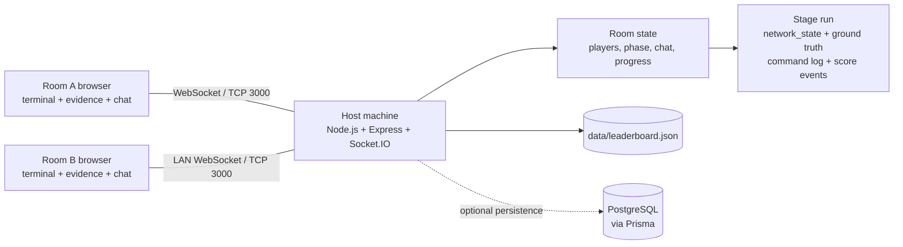

# Network Architecture Diagram

The host keeps the authoritative game state. Browsers never talk to each other directly: every terminal command, report form, hint and chat message goes to the server, which runs it against the simulated network of that room and returns only what that room is allowed to see.

Each stage run holds:

- `state` — the live simulated configuration (`network_state.live_config`) changed by configuration commands
- `truth` — the ground truth (`correct_answer`) used to decide simulation results; it is never sent to a client
- `commandLog` / `scoreEvents` — the `command_log` and `score_events` tables from the design document

Per-room views (`stage_data.visible_fields`) are built by `roleView()` in `server/game/engine.js`.
