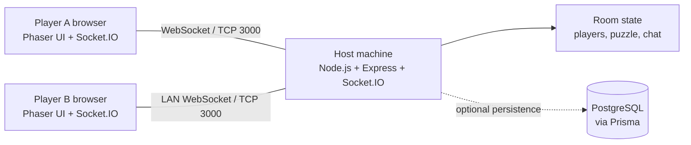

# Network Architecture Diagram

Host-based design keeps the authoritative game state on one student's machine. Browsers never connect directly to each other; all actions are validated and broadcast by Socket.IO. PostgreSQL is optional for demo mode and can store session history, scores, and solved counts in a production version.
