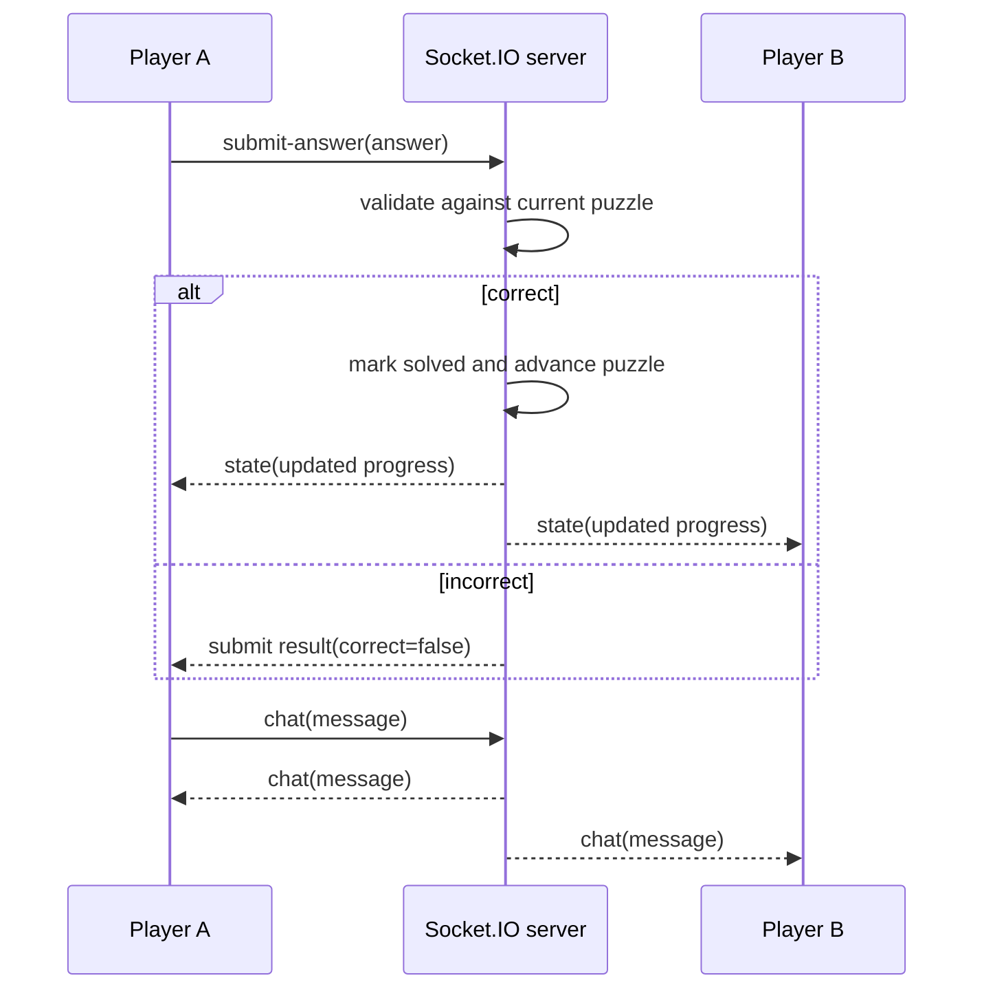

# Sequence Diagram: action → server → broadcast

```mermaid
sequenceDiagram
  participant A as Player A
  participant S as Socket.IO server
  participant B as Player B
  A->>S: submit-answer(answer)
  S->>S: validate against current puzzle
  alt correct
    S->>S: mark solved and advance puzzle
    S-->>A: state(updated progress)
    S-->>B: state(updated progress)
  else incorrect
    S-->>A: submit result(correct=false)
  end
  A->>S: chat(message)
  S-->>A: chat(message)
  S-->>B: chat(message)
```

The server is authoritative: clients render the state they receive and cannot advance the puzzle locally.
