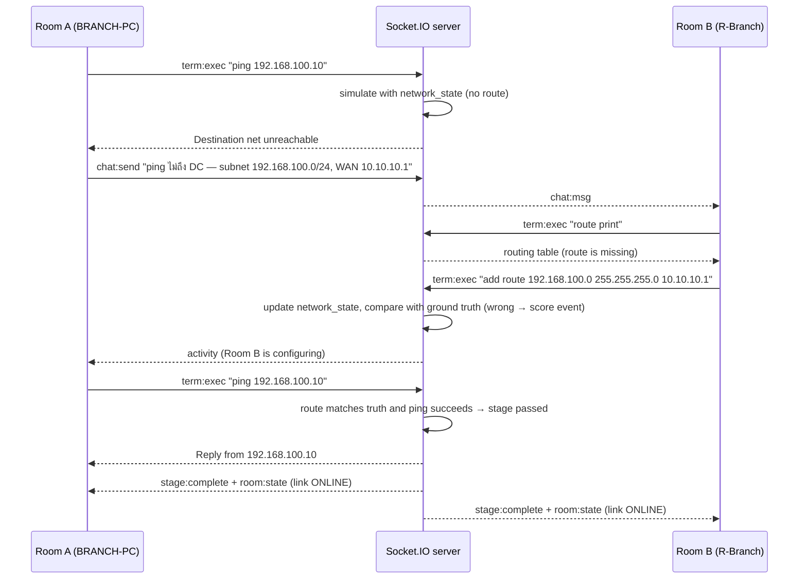

# Sequence Diagram: configure → verify → System Link ONLINE

Example: stage 8 (missing static route). Room B controls the router, Room A has the topology and the branch PC.

Socket.IO events used by the client: `room:create`, `room:join`, `room:leave`, `lobby:character`, `lobby:ready`, `lobby:swap`, `lobby:start`, `stage:catalog`, `stage:start`, `stage:quit`, `term:exec`, `form:submit`, `hint:reveal`, `chat:send`, `activity`. The server pushes `room:state`, `stage:view` (per room), `chat:history`, `chat:msg`, `activity` and `stage:complete`.
